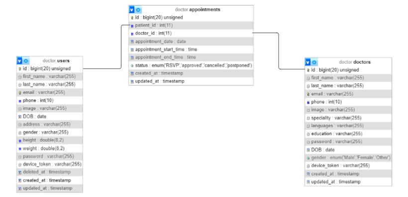

# Doctor Booking System

## Table of Contents
1. [Introduction](#introduction)
   - [Project Overview](#project-overview)
   - [Description](#description)
   - [Important Notes](#important-notes)
2. [Database Schema](#DatabaseSchema)
3. [Authentication](#authentication)
4. [Appointment Module](#appointment-module)
   - [Create Appointment](#create-appointment)
   - [Update Appointment](#update-appointment)
   - [Doctor Update Status of Appointment](#doctor-update-status-of-appointment)
   - [View List of Appointments](#view-list-of-appointments)
5. [Doctor Module](#doctor-module)
   - [Create Doctor](#create-doctor)
   - [Update Doctor Info](#update-doctor-info)
   - [View Appointments](#view-appointments)
   - [Update Status of Appointment (Doctor)](#update-status-of-appointment-doctor)
6. [Patient / User Module](#patient--user-module)
   - [Create Patient](#create-patient)
   - [Update Patient Info](#update-patient-info)
   - [User Login](#user-login)
   - [Create Appointment](#create-appointment-user)
   - [Update Appointment](#update-appointment-user)
   - [View List of Their Appointments](#view-list-of-their-appointments)

## Introduction

### Project Overview
The Doctor Booking System is a Laravel-based online application that allows patients to schedule appointments with doctors. It provides a platform for efficiently managing appointments and serves both patients and doctors.

### Description
This documentation outlines the Doctor Booking System's APIs and their functionalities. It covers various modules, including patient/user interactions, appointment management, doctor-specific features, and authentication.

### Important Notes
- The project is hosted on GitHub.
- The project follows a specific design pattern, as described in the README.md file.
- Detailed database schema designs are available within the project.

## Database Schema for Doctor

## Authentication

To access the APIs, users must be authenticated. Unauthorized access is restricted.

### Doctor Model
- When a doctor registers or logs in, a unique device token is generated for that doctor.
- This device token is stored in the doctor's database record.

### Patient Model
- When a patient registers or logs in, a unique device token is generated for that patient.
- This device token is stored in the patient's database record.

### API Authentication
- For each API request, the request headers are checked to ensure that a device token is included.
- The device token is verified against the records in the doctor and patient models to determine whether the user is a doctor or a patient.
- If the device token matches a doctor's token, access to doctor-specific API endpoints is granted.
- If the device token matches a patient's token, access to patient-specific API endpoints is granted.
- If the device token does not match any records, the request is rejected as unauthorized.

## Appointment Module

The Appointment Module is designed for patients to book and manage appointments. It includes four main APIs:

### Create Appointment
- Endpoint: `/api/addAppointment/`
- Method: POST
- Description:
  - Allows patients to create appointments.
  - Prevents two patients from booking an appointment at the same date and time.
  - Appointments are RSVP until approved by the doctor.
- Request Parameters:
  - `patient_id` (integer): ID of the patient creating the appointment.
  - `doctor_id` (integer): ID of the doctor the patient wants to book an appointment with.
  - `appointment_date` (string, format: 'Y-m-d'): Date of the appointment.
  - `appointment_start_time` (string, format: 'H:i'): Start time of the appointment.
- Response:
  - Success (HTTP Status Code: 201 Created): Returns a success message upon successful appointment creation.
  - Error (HTTP Status Code: 400 Bad Request or 409 Conflict): Returns an error message if the appointment conflicts with an existing one.

### Update Appointment
- Endpoint: `/api/updateAppointment`
- Method: POST
- Description:
  - Allows patients to update the date and time of their appointments.
  - Ensures that the new date and time do not conflict with existing appointments.
- Request Parameters:
  - `appointment_date` (string, format: 'Y-m-d'): New date for the appointment.
  - `appointment_start_time` (string, format: 'H:i'): New start time for the appointment.
- Response:
  - Success (HTTP Status Code: 200 OK): Returns a success message upon successful update.
  - Error (HTTP Status Code: 400 Bad Request or 409 Conflict): Returns an error message if the new date and time conflict with existing appointments.

### Doctor Update Status of Appointment
- Endpoint: `/api/changeStatus/{id}`
- Method: POST
- Description:
  - Allows doctors to update the status of appointments they manage.
  - Status options: 'approved', 'cancelled', 'postponed'.
- Request Parameters:
  - `id` (integer, path): ID of the appointment to update.
  - `status` (string): New status for the appointment.
  - `appointment_date` (date, format: 'Y-m-d') [Required if status is 'postponed']: New date for the appointment.
  - `appointment_start_time` (time, format: 'H:i') [Required if status is 'postponed']: New start time for the appointment.
- Response:
  - Success (HTTP Status Code: 200 OK): Returns a success message upon successful status update.
  - Error (HTTP Status Code: 401 Unauthorized or 404 Not Found): Returns an error message if the appointment or doctor is not valid.

### View List of Appointments
- Endpoint: `/api/listAllAppointments`
- Method: POST
- Description:
  - Allows patients to view a list of their appointments.
  - Provides filtering by date.
  - Returns user-specific appointment information.
- Request Parameters:
  - `date` (string, format: 'Y-m-d'): Optional date for filtering appointments.
- Response:
  - Success (HTTP Status Code: 200 OK): Returns a list of appointments based on the filter criteria.
  - Error (HTTP Status Code: 401 Unauthorized or 404 Not Found): Returns an error message if the user or appointments are not found.

## Doctor Module

The Doctor Module is designed for doctors to manage their appointments and doctor-specific information. It includes four main APIs:

### Create Doctor
- Endpoint: `/api/adminSignup`
- Method: POST
- Description:
  - Allows the creation of doctor profiles.
  - Requires essential doctor information such as name, contact details, specialty, and more.
- Request Parameters:
  - `first_name` (string): First name of the doctor.
  - `last_name` (string): Last name of the doctor.
  - `email` (string, format: email): Email address of the doctor.
  - `phone` (string): Phone number of the doctor.
  - `speciality` (string): Specialty of the doctor.
  - `languages` (string): Languages spoken by the doctor.
  - `education` (string): Educational qualifications of the doctor.
  - `DOB` (date, format: 'Y-m-d'): Date of birth of the doctor.
  - `gender` (string): Gender of the doctor.
  - `device_token` (string): Device token for authentication.
  - `image` (file): Profile image of the doctor.
- Response:
  - Success (HTTP Status Code: 201 Created): Returns a success message upon successful doctor profile creation.
  - Error (HTTP Status Code: 400 Bad Request): Returns an error message if the doctor profile creation fails.

### Update Doctor Info
- Endpoint: `/api/adminUpdate`
- Method: POST
- Description:
  - Allows doctors to update their profile information.
- Request Parameters:
  - Any parameters that need to be updated (e.g., `first_name`, `last_name`, etc.).
- Response:
  - Success (HTTP Status Code: 200 OK): Returns a success message upon successful profile update.
  - Error (HTTP Status Code: 400 Bad Request): Returns an error message if the update fails.

### Doctor Login
- Endpoint: `/api/adminLogin`
- Method: POST
- Description:
  - Allows doctors to log in using their email and password.
- Request Parameters:
  - `email` (string, format: email) [Required]: Email address of the doctor.
  - `password` (string) [Required]: Doctor's password.
- Response:
  - Success (HTTP Status Code: 200 OK): Returns a success message along with an access token upon successful login.
  - Error (HTTP Status Code: 401 Unauthorized): Returns an error message if the provided credentials are invalid.
  - Error (HTTP Status Code: 400 Bad Request): Returns an error message if the required parameters (email and password) are missing.

### View Appointments
- Endpoint: `/api/listAppointmentsByDoctor`
- Method: POST
- Description:
  - Allows doctors to view a list of their appointments.
  - Provides filtering by date.
  - Returns user-specific appointment information.
- Request Parameters:
  - `date` (string, format: 'Y-m-d'): Optional date for filtering appointments.
- Response:
  - Success (HTTP Status Code: 200 OK): Returns a list of appointments based on the filter criteria.
  - Error (HTTP Status Code: 401 Unauthorized or 404 Not Found): Returns an error message if the doctor or appointments are not found.

### Update Status of Appointment (Doctor)
- Endpoint: `/api/changeStatus/{id}`
- Method: POST
- Description:
  - Allows doctors to update the status of appointments they manage.
  - Status options: 'approved', 'cancelled', 'postponed'.
- Request Parameters:
  - `status` (string): New status for the appointment.
  - `appointment_date` (date, format: 'Y-m-d') [Required if status is 'postponed']: New date for the appointment.
  - `appointment_start_time` (time, format: 'H:i') [Required if status is 'postponed']: New start time for the appointment.
- Response:
  - Success (HTTP Status Code: 200 OK): Returns a success message upon successful status update.
  - Error (HTTP Status Code: 401 Unauthorized or 404 Not Found): Returns an error message if the appointment or doctor is not valid.

## Patient / User Module

The Patient/User Module allows users to interact with the system. It includes five main APIs:

### Create Patient
- Endpoint: `/api/adminSignup`
- Method: POST
- Description:
  - Allows the creation of patient profiles.
  - Requires essential patient information such as name, contact details, date of birth, and more.
- Request Parameters:
  - `first_name` (string): First name of the patient.
  - `last_name` (string): Last name of the patient.
  - `email` (string, format: email): Email address of the patient.
  - `phone` (string): Phone number of the patient.
  - `DOB` (date, format: 'Y-m-d'): Date of birth of the patient.
  - `gender` (string): Gender of the patient.
  - `device_token` (string): Device token for authentication.
  - `image` (file): Profile image of the patient.
- Response:
  - Success (HTTP Status Code: 201 Created): Returns a success message upon successful patient profile creation.
  - Error (HTTP Status Code: 400 Bad Request): Returns an error message if the patient profile creation fails.

### Update Patient Info
- Endpoint: `/api/adminUpdate`
- Method: POST
- Description:
  - Allows patients to update their profile information.
- Request Parameters:
  - Any parameters that need to be updated (e.g., `first_name`, `last_name`, etc.).
- Response:
  - Success (HTTP Status Code: 200 OK): Returns a success message upon successful profile update.
  - Error (HTTP Status Code: 400 Bad Request): Returns an error message if the update fails.

### User Login
- Endpoint: `/api/userLogin`
- Method: POST
- Description:
  - Allows users (patients) to log in using their email and password.
- Request Parameters:
  - `email` (string, format: email) [Required]: Email address of the user.
  - `password` (string) [Required]: User's password.
- Response:
  - Success (HTTP Status Code: 200 OK): Returns a success message along with an access token upon successful login.
  - Error (HTTP Status Code: 401 Unauthorized): Returns an error message if the provided credentials are invalid.
  - Error (HTTP Status Code: 400 Bad Request): Returns an error message if the required parameters (email and password) are missing.

### Create Appointment (User)
- Endpoint: `/api/addAppointment`
- Method: POST
- Description:
  - Allows patients to create appointments.
  - Prevents two patients from booking an appointment at the same date and time.
  - Appointments are RSVP until approved by the doctor.
- Request Parameters:
  - `patient_id` (integer): ID of the patient creating the appointment.
  - `doctor_id` (integer): ID of the doctor the patient wants to book an appointment with.
  - `appointment_date` (string, format: 'Y-m-d'): Date of the appointment.
  - `appointment_start_time` (string, format: 'H:i'): Start time of the appointment.
- Response:
  - Success (HTTP Status Code: 201 Created): Returns a success message upon successful appointment creation.
  - Error (HTTP Status Code: 400 Bad Request or 409 Conflict): Returns an error message if the appointment conflicts with an existing one.

### Update Appointment (User)
- Endpoint: `/api/updateAppointment`
- Method: POST
- Description:
  - Allows patients to update the date and time of their appointments.
  - Ensures that the new date and time do not conflict with existing appointments.
- Request Parameters:
  - `appointment_date` (string, format: 'Y-m-d'): New date for the appointment.
  - `appointment_start_time` (string, format: 'H:i'): New start time for the appointment.
- Response:
  - Success (HTTP Status Code: 200 OK): Returns a success message upon successful update.
  - Error (HTTP Status Code: 400 Bad Request or 409 Conflict): Returns an error message if the new date and time conflict with existing appointments.

### View List of Their Appointments
- Endpoint: `/api/listAppointmentsByUser`
- Method: POST
- Description:
  - Allows patients to view a list of their appointments.
  - Provides filtering by date.
  - Returns user-specific appointment information.
- Request Parameters:
  - `date` (string, format: 'Y-m-d'): Optional date for filtering appointments.
- Response:
  - Success (HTTP Status Code: 200 OK): Returns a list of appointments based on the filter criteria.
  - Error (HTTP Status Code: 401 Unauthorized or 404 Not Found): Returns an error message if the user or appointments are not found.
